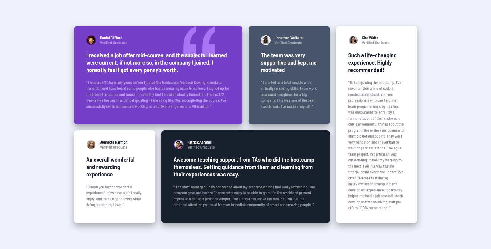

# Frontend Mentor - Testimonials grid section solution

This is a solution to the [Testimonials grid section challenge on Frontend Mentor](https://www.frontendmentor.io/challenges/testimonials-grid-section-Nnw6J7Un7). Frontend Mentor challenges help you improve your coding skills by building realistic projects.

## Table of contents

- [Overview](#overview)
  - [The challenge](#the-challenge)
  - [Screenshot](#screenshot)
  - [Links](#links)
- [My process](#my-process)
  - [Built with](#built-with)
  - [What I learned](#what-i-learned)
  - [Continued development](#continued-development)
  - [Useful resources](#useful-resources)
- [Author](#author)

## Overview

### The challenge

Users should be able to:

- View the optimal layout for the site depending on their device's screen size

### Screenshot



### Links

- Solution URL: [Add solution URL here](https://your-solution-url.com)
- Live Site URL: [Add live site URL here](https://your-live-site-url.com)

## My process

### Built with

- Semantic HTML5 markup
- CSS custom properties
- Flexbox
- CSS Grid
- Mobile-first workflow

### What I learned

```css

@media screen and (min-width: 768px) {
  main {
    grid-template-columns: repeat(3, 1fr);
    grid-template-rows: repeat(3, min-content);
  }

  .card-1 {
    grid-column: 1 / 3;
  }

  .card-2 {
    grid-column: 3 / 4;
  }

  .card-3 {
    grid-column: 1 / 2;
  }

  .card-4 {
    grid-column: 2 / 4;
  }

  .card-5 {
    grid-column: 1 / 4;
    grid-row: 3 / 4;
  }
}

```

### Continued development

### Useful resources

- [Grid Garden](https://cssgridgarden.com/)
- [Flexbox Froggy](https://flexboxfroggy.com/)
## Author

- Frontend Mentor - [@limsael](https://www.frontendmentor.io/profile/limsael)
- Twitter - [@limsael525](https://www.twitter.com/limsael525)
- GitHub - [@limsael](https://www.github.com/limsael)
